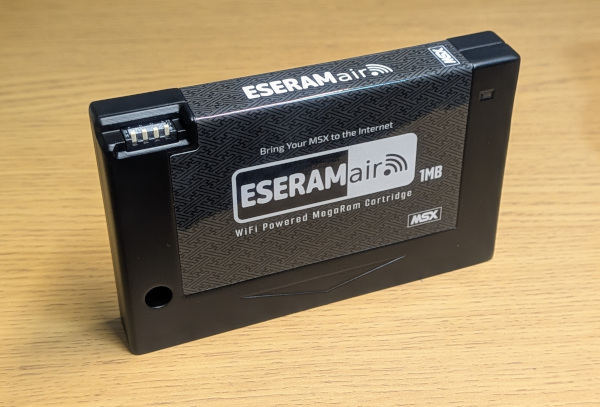

# ESERAMair

MSX 界隈では有名な「**似非RAMディスク**」に WiFi 機能を持たせた ESERAMair の公式ページです。

似非RAMディスクの中身を WiFi 経由で読み書きできるようにすることで、PC と MSX をもっと簡単に連携できるようにします。

興味を持たれた方は、[Introduction](docs/Introduction.md)もお読みください。

使い方は [Getting Started](docs/GettingStarted.md) に書いてあります。

# ここだけは読んで

以下の点を御理解の上、購入、利用をお願いします。

- ESERAMairは同人ハードウェアであり、個人が趣味で作ったものですので、メーカーによる製品の品質レベルとは遠くかけ離れています。
- 全品検査して出荷していますが、ハードウェアである以上、お使いのMSXにダメージを与えてしまう可能性があります。その場合でも補償はできかねます。At your own risk でご利用ください。
- ESERAMairのカートリッジシェルは3Dプリント品であり、耐久性は未知数です。塗装の仕上がりにもムラがある可能性があります。
- 善処しますが、動作保証やサポートをお約束できるものではありません。
- 開発が継続することはお約束できません。

# 仕様

- 対応機種
   - Nextor使用時: RAM 64kB以上を積んだ MSX1/2/2+/turboR ※1
   - MEGAROM/ROMエミュレータ使用時: そのROMイメージの仕様に準じます
- WiFi
   - IEEE802.11n 2.4GHz ※5GHzには対応していません

※1 .. 全てのMSXで動作することを保証するものではありません

## 動作確認済み機種

- Panasonic FS-A1
- Panasonic FS-A1F
- Panasonic FS-A1WSX

# ドキュメント

最初に読んでほしいドキュメント

1. [Introduction](docs/Introduction.md)
1. [Getting Started](docs/GettingStarted.md)

各種機能

1. [BackupToFlash](docs/BackupToFlash.md)
1. [Update Firmware](docs/UpdateFW.md)
1. [USBコンソールコマンド](docs/USBCLI.md)
1. [REST API](docs/RESTAPI.md)

# ライセンス

ESERAMair のライセンスは [LICENSE.md](LICENSE.md) を参照ください。

## オープンソースソフトウェア

ESERAMair の FW, ROM には以下のソフトウェアが使用されています。

- pico-sdk
- lwIP
- cyw43-driver
- littlefs
- microrl-remaster
- fatfs
- Nextor
- JSZip

Copyright やライセンス原文は [LICENSE.thirdparty.md](LICENSE.thirdparty.md) を参照ください。

# 謝辞

以下の方々にはモニターテストにご参加いただき、動作確認にご協力頂きました。
おかげさまで多くの機種で動作確認ができ、不具合を見つけることもできました。
他にも使い勝手のフィードバックをいただくなど、感謝してもしきれません。
ご協力いただきましてありがとうございました。

- ごりぽん (@goripon_tw) さん
- やりにげ (@Holiday_Program) さん
- KAPPY. (@KAPPY_2164) さん
- KS (@kickstate7) さん
- ニューファンキー小林 (@nf_ban) さん
- renatus (@renatus_xxxx) さん
- ゆうじろう (@SEGA_SG1000II) さん
- suepy (@suepu) さん
- tacosan (@tacosan22044698) さん
- HRA! (@thara1129) さん
- TKZ80 (@TKZ80) さん
- つかぽん (@t_tsuka) さん

※ Xアカウントのアルファベット順

# FAQ

## ESERAMair なの？ ESERAM air なの？ 似非RAM air なの？

なるべく ESERAMair で書くようにしていますが、表記は ESERAMair, ESERAM air, 似非RAMair, 似非RAM air いずれもOKです。
