# Getting Started

## ボタン電池を入れる

バッテリバックアップ用に CR2032 が必要です。

裏側のネジを外し基板を取り出します。

> [!Warning]
> 前面と裏面のシェルはラベルで繋がっており分離しません。ラベルを切らないようにご注意ください。

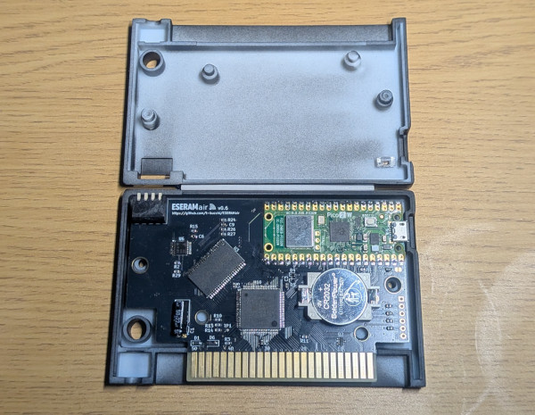

電池ボックスにCR2032を装着し、シェルを閉じます。

> [!Warning]
> カートリッジシェルは3Dプリンタ品であるため、破損しやすいです。ネジは優しく締めるようにしてください。

## WiFiの設定

WiFi の SSID,パスワードを設定する方法です。
PCには teraterm, putty などのターミナルソフトが必要です。
Linux なら putty, minicom, screen などシリアル端末用のターミナルソフトが使えます。

以下は teraterm を使った手順を記載します。

### 1. micro USBでPCと接続します

ESERAMair を MSX から取り外した状態で、micro USB-B ケーブルで PC と接続します。
ESERAMair に電源が入り、LEDが素早い点滅になると思います。

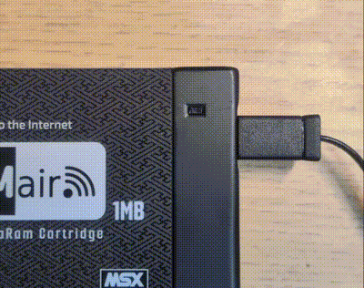

接続すると、COMデバイスとして認識されます。

### 2. ターミナルソフトでUSBコンソールを開きます

teratermを開き、COMポートを選択します。

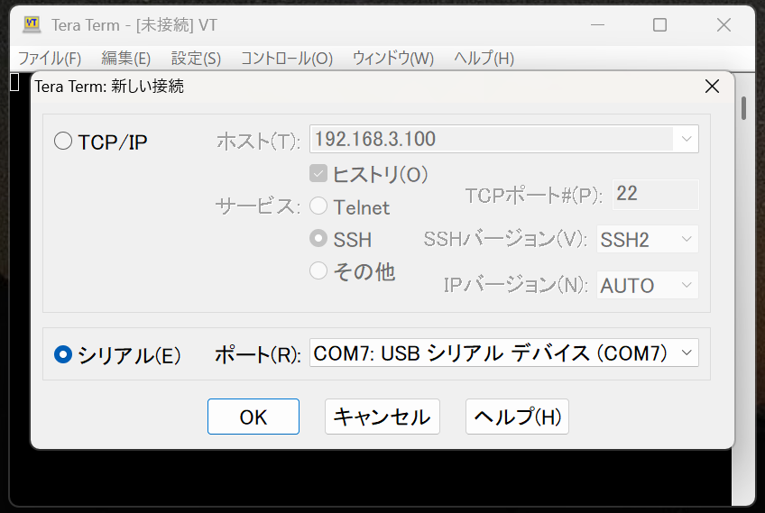

開けたら数回Enterキーを謳歌してみてください。
プロンプトが表示されれば接続OKです。

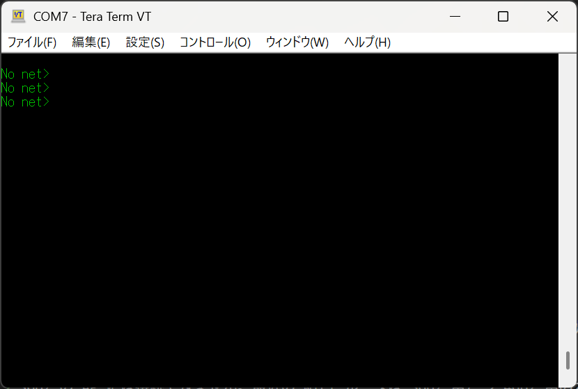

### 3. setwifi コマンドでSSIDとパスワードを設定します

プロンプトに以下のように入力してください。
`<SSID>` と `<PASSWORD>` は適宜置き換えてください。

```
set_wifi <SSID> <PASSWORD>
```
**例:**
```
set_wifi homeAP HirakeGOMA
```

SSID、パスワードは日本語はダメです。半角英数記号で入力してください。

設定がうまくいけば、緑LED高速に点滅し、その後 チカッ・・チカッ・・のように、たまに点灯する点滅に変わるはずです。

チカッ・・チカッ・・となったら AP に接続完了して IPアドレスが取れたことを意味します。

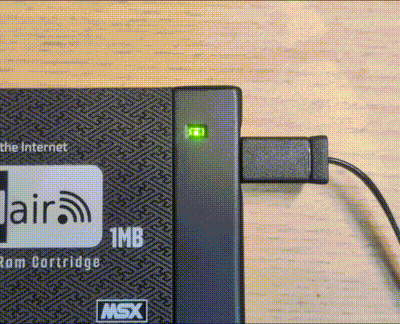

> [!Warning]
> 5GHz の AP には接続できません。最近の WiFi ルータは 5GHz 用と 2.4GHz 用の2つのSSIDが有ることが多いので、2.4GHzのSSIDを設定するようにしてください。

WiFiに接続した状態で USB コンソールで Enter を押すと、プロンプトにIPアドレスが表示されます。
ブラウザからアクセスするためにこの IPアドレスを使用します。

> [!NOTE]
> 確実にIPアドレスを知ることができる方法はこの方法しかありません。IPが分からないときはUSBを繋げてEnterを!!

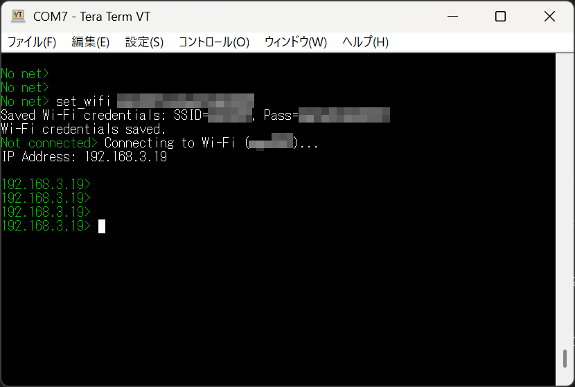

デフォルトでDHCPでIPアドレスを取得しますが、固定IPでの設定も可能です。 ([USBCLI.mdのipコマンド](USBCLI.md#ip)を参照)

## Nextor ROMイメージの書き込み

※ここからは USB 経由での電源供給だけでなく、MSXに装着して電源を入れることでも同様の操作が可能です。

### 1. DIPSW を確認

4 bit 分ある DIPSW を全て OFF (前面側に倒す) にしてください。<br />
Nextor を使うには、MegaROMモードで8kバンク設定である必要があります。

1. Enable/Disable → Enable
2. 8k/16kバンク → 8k
3. フラットROM ON/OFF → OFF
4. WriteProtect OFF/ON → OFF

### 2. ROMイメージをダウンロードする

<a href="../../../releases">Releases</a>から `nextor-eseramair-{VER}.rom` (以下、`nextor-eseramair.rom`)をダウンロードします。

### 3. ブラウザからESERAMairにアクセスする

お使いのブラウザで、`http://IPアドレス/` を開いてください。

以下のような画面が表示されればOKです。<br />
表示されない場合はWiFiにつながっているか(LEDがチカッ・・チカッ・・という点滅になっているか)、IPアドレスが合っているかを確認してください。

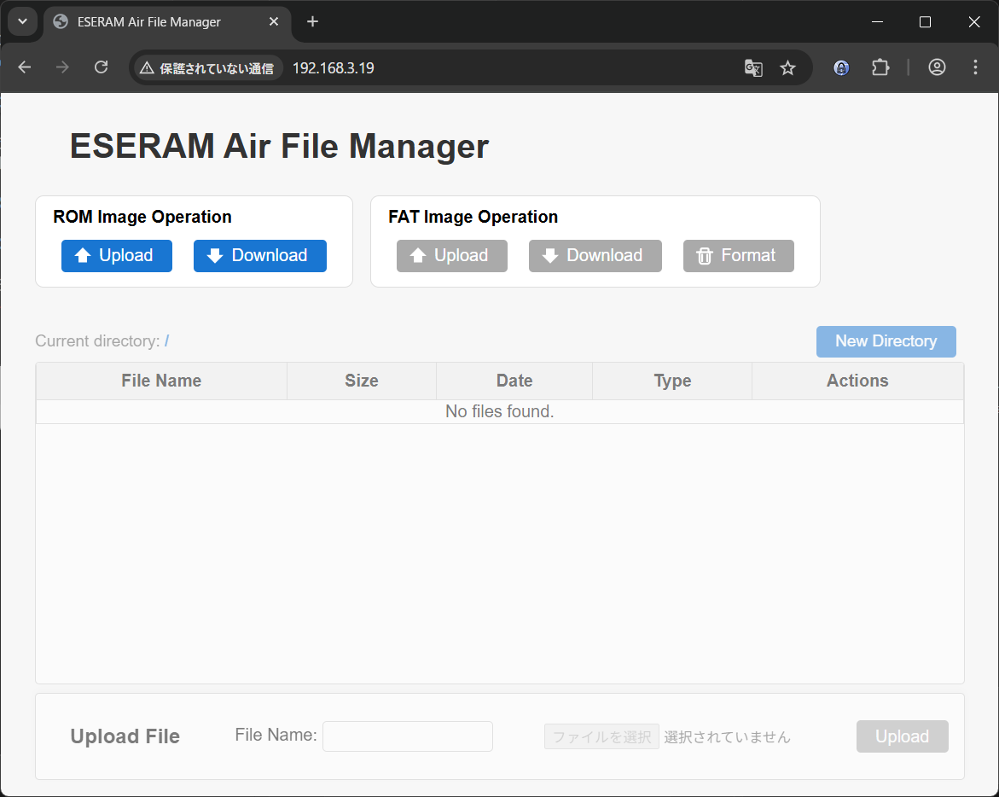

### 4. NextorROMを書き込む

ブラウザの「ROM Image Operation」の「Upload」を押下するとダイアログが開きます。`nextor-eseramair.rom` を選択して「Upload」を押すと `nextor-eseramair.rom` が ESERAMair にアップロードされます。

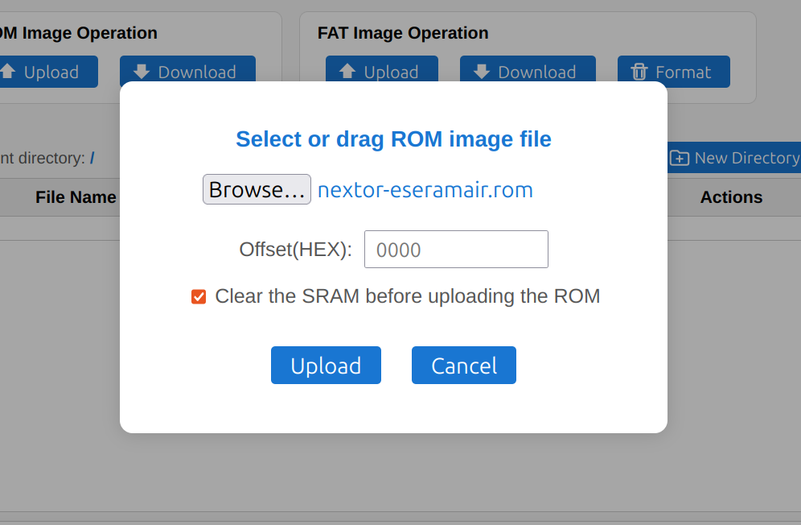

> [!NOTE]
> ページの赤枠に `nextor-eseramair.rom` をドラッグアンドドロップすることでもアップロードすることができます。
>
> 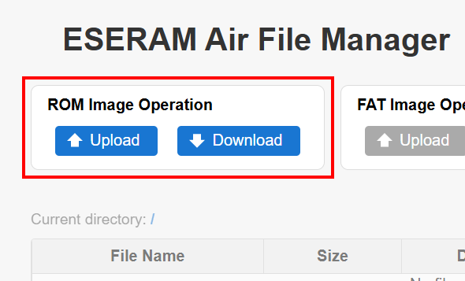

### 5. Formatする

`nextor-eseramair.rom`を書き込むと、「FAT Image Operation」側が有効になります。

初期状態ではファイルシステムが書き込まれていないため Format を押してフォーマットします。

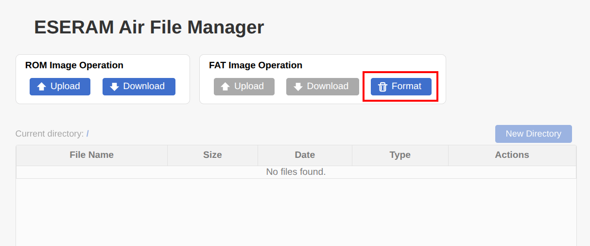

フォーマットが完了すると、下のファイルリストも有効化されます。

この状態になればファイルを操作できます。

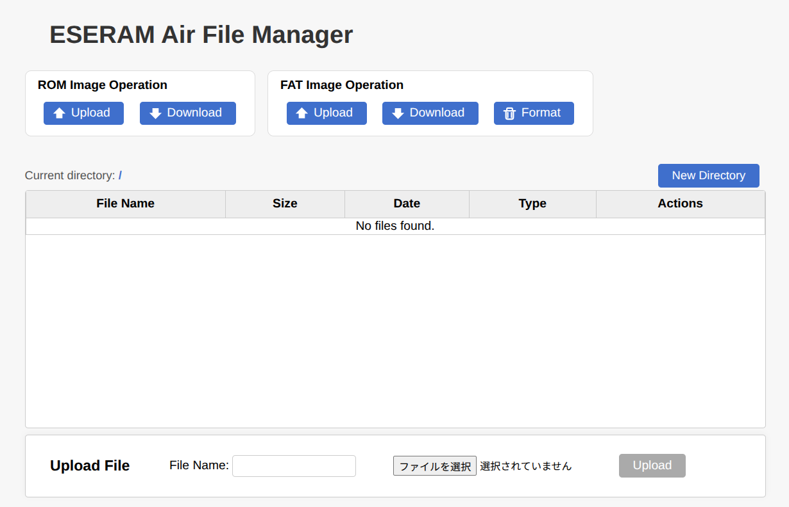

> [!NOTE]
> ディスクの容量は 896kB です。
> 2DD のフロッピーディスクよりも少し大きい容量となります。
>
> 1024kBのうち、Nextor kernel と ESERAMair ドライバで 128kB を消費します。


## ファイルの upload/download

画面下部の「Upload File」からファイル単体のアップロードをすることができます。

> [!NOTE]
> この領域にドラッグアンドドロップすることでもアップロードすることができます。

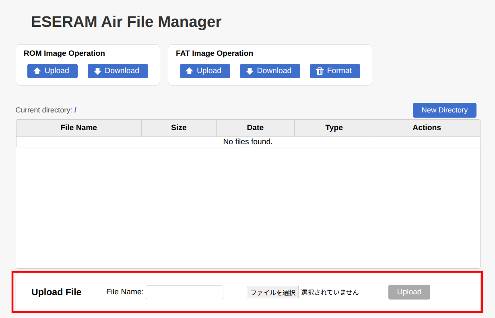

MSX のファイル名は 8.3 形式である必要があるため、MSX側のファイル名を「File name:」に入力した上で「Upload」ボタンを押すことでアップロードすることができます。

> [!Warning]
> 現時点では英数字のみに対応しており、カタカナ、ひらがなは未対応です。

アップロードが完了すると以下のようにファイル一覧に追加されます。

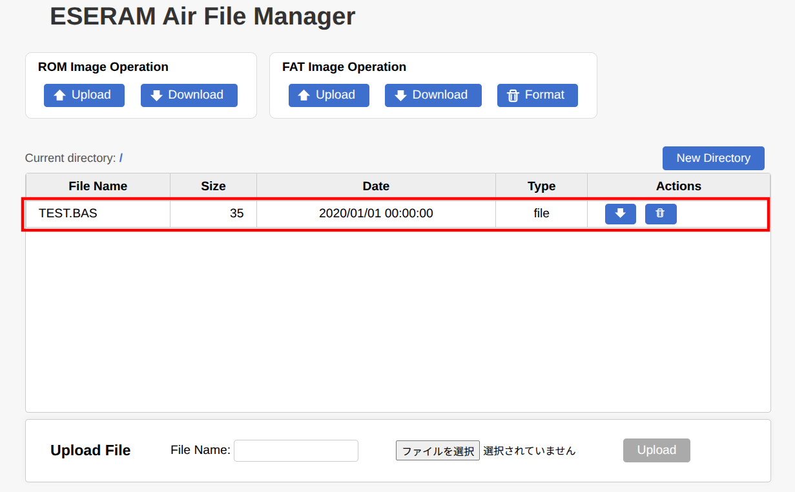

## MSX側からファイルの確認

ESERARMair から USB を抜き、MSX にカートリッジを挿して MSX の電源を入れます。<br />
NextorのRAMDISK機能を使うためにはメインメモリ 64kB 以上の MSX が必要です。
64kB 以上であれば MSX1/2/2+/TurboR いずれも使用可能です。

> [!NOTE]
> USBで電源を供給しながらMSXの電源を入れても大丈夫です

電源を入れると Disk BASIC が起動するので `FILES` を実行してみてください。
上の手順でアップロードしたファイルが見えれば OK です。

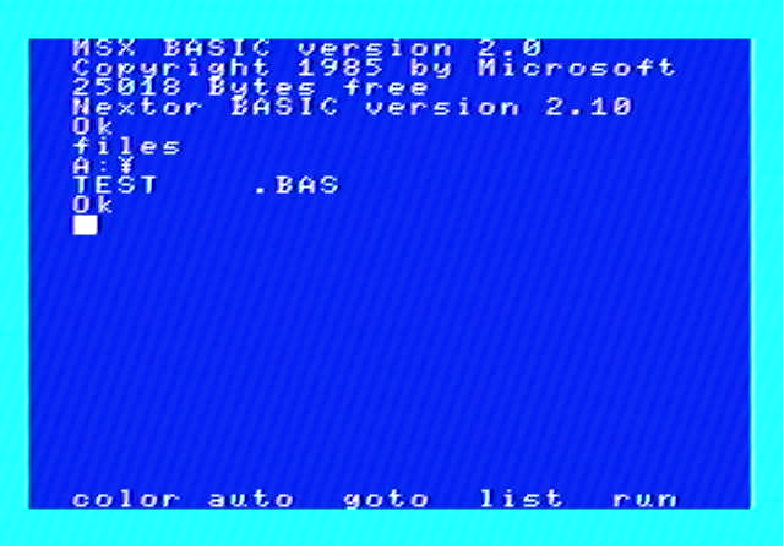

MSX側で作成したファイルもブラウザをリロードすれば見えるはずです。
これで自由に PC と MSX でファイルのやり取りができます。

おめでとうございます！ ESERAMair が使えるようになりました。

# その他の操作

## ディスクイメージのダウンロード

ディスクの内容飲みを保存するのであれば、「FAT Image Operation」の「Download」をクリックしてください。

"fatimage.bin" というファイル名でダウンロードできます。
サイズは 896kB 固定です。

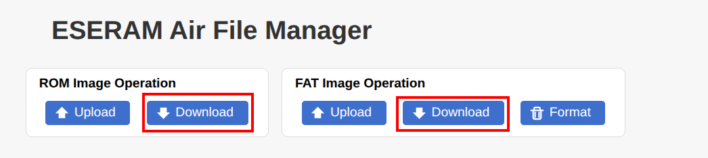

Nextor kernel 等も込みで、1MB の SRAM 内容全てをダウンロード(バックアップ)したいときは「ROM Image Operation」の「Download」をクリックしてください。

## ディスクイメージのアップロード

上記でバックアップしたESERAMのディスクイメージだけでなく、2DD の.DSK ファイルイメージをアップロードすることで、ディスクを挿入したように見せかけることもできます。


.DSK ファイルをアップロードした場合は、そのイメージの容量になります。896kB 分使えるわけではないのでご注意ください。

## メガロムイメージのアップロード

「ROM Image Operation」の「Upload」からメガロムイメージをアップロードすることができます。

> [!Warning]
> 似非RAMディスクの内容は破壊されますのでご注意ください。

起動させる際には 8k/16k のバンクサイズスイッチを適切に切り替えてください。一致していないと起動しませんのでご注意ください。

# LEDの状態

LEDは以下の2パターンになります

- 早い点滅
- チカッ・・チカッ・・という点滅

## 早い点滅

WiFi接続中の状態です。
APに接続できていなかったり、DHCPでIPが取得できていない状態です。


## チカッ・・チカッ・・という点滅

APに接続できてIPアドレスも取得できており、通信可能な状態です。


# DIPSW

4つあるDIPスイッチはそれぞれ以下の機能を持ちます。

- SLOT Disable
- バンクサイズ切り替え
- ROMエミュレータON/OFF
- WriteProtect

基本的には全てOFF(手前側に倒れた状態)で使います。


背面に設定値簡単な説明も書いてありますので参考にしてください。

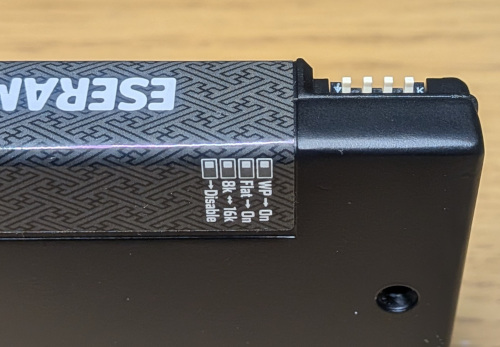

## SLOT Disable

カートリッジを抜かなくてもESERAMairを無効化する機能です。
FDDから起動してSRAMにイメージを書き込みたいときなどに使います。

- OFF(手前側)
   - ESERAMairは有効です
- ON(奥側)
   - ESERAMairはスロットに刺さっていないのとを同じ状態です

## バンクサイズ切り替え

メガロムコントローラのバンクサイズを8k/16kから選択します。<br />
※ROMエミュレータがOFFのときだけ有効です。

Nextorを使う場合は8kにする必要があります。<br />
Nextor本体は16kもサポートしますが、ESERAMair用Driverが8k専用になっています。

- OFF(手前側)
   - 8k
- ON(奥側)
   - 16k

## ROMエミュレータON/OFF

メガロムではなく、フラットなROMのエミュレーションをします。

SRAMの先頭64kBを、そのまま page0〜3 にマッピングします。<br />
例えば、page1 を使った 0x4000〜0x7FFF の16KBのゲームは、SRAMの先頭ではなくオフセット0x4000に書き込みます。

ROMなので、MSXからは書き換えられません。

- OFF(手前側)
   - ROMエミュレータOFF (メガロムが有効)
- ON(奥側)
   - ROMエミュレータON

## Write Protect

SRAMへの書き込みを禁止するスイッチです。

あまり使うことはないと思いますが、電源OFFやリセット時にどうしてもSRAMデータが壊れてしまうような機種の場合、電源を切る前にプロテクトをONにすると、データ破壊を防げる可能性があります。

また、どうしても電源を入れたままカートリッジを抜かなければならない(そんなケースある？)場合でも、データ破壊を防げる可能性があります。

- OFF(手前側)
  - 書き込み許可
- ON(奥側)
  - 書き込み禁止

# 起動画面

nextor-eseramair.rom の起動時に以下のような画面が表示されます。
ここでも IP アドレスを確認することができます。

> [!NOTE]
> ゲームのROMが書いてあるなど、nextor-eseramair.rom が書かれていない時は表示されません。
> その場合は[USBを接続して](#3-setwifi-%E3%82%B3%E3%83%9E%E3%83%B3%E3%83%89%E3%81%A7ssid%E3%81%A8%E3%83%91%E3%82%B9%E3%83%AF%E3%83%BC%E3%83%89%E3%82%92%E8%A8%AD%E5%AE%9A%E3%81%97%E3%81%BE%E3%81%99)IPアドレスをご確認ください。

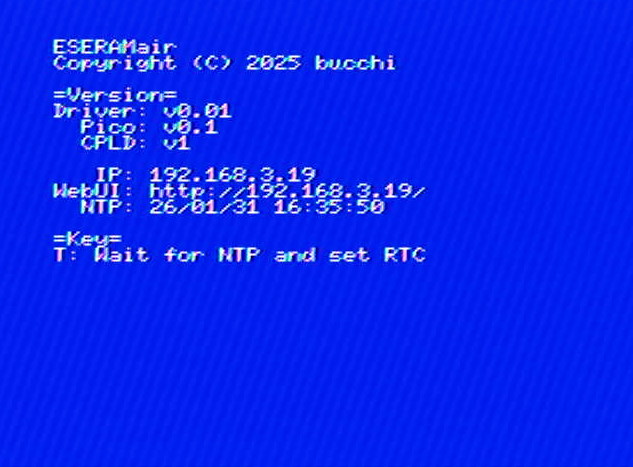

以下の内容が表示されます。

- Driver:
   - nextor-eseramair.rom のバージョン
- Pico:
   - Raspberry Pi Pico 2W に書き込まれたファームウェアのバージョン
- CPLD:
   - CPLDのバージョン
- IP:
   - 取得したIPアドレス (WiFi接続成功時)
- WebUI:
   - ブラウザでアクセスする URL
- NTP:
   - NTPで取得した現在の日時

MSX2以上の機種では、Tを押しながら電源を入れると、NTPで取得した時刻をRTCに設定することができます。

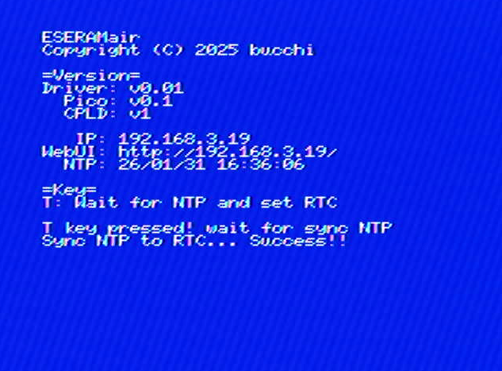

# Update Firmware

Raspiberry Pi Picoのファームウェア更新手順を記載します。

## 1. Pico FW イメージをダウンロードする

<a href="../../../releases">Releases</a>から `eseramair-pico-{VER}.uf2` (以下、`eseramair-pico.uf2`)をダウンロードします。

## 2. カットリッジを開ける

裏側のネジを外し基板を取り出します。

> [!Warning]
> 前面と裏面のシェルはラベルで繋がっており分離しません。ラベルを切らないようにご注意ください。


## 3. BOOTSELボタンを押しながら micro USB でPCと接続する

Pico上にある BOOTSEL と書かれたスイッチを押しながら micro USB で PC と接続してください。

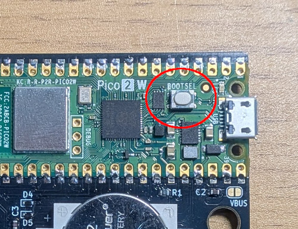

LEDは消灯したままになり、PCにUSBドライブが認識されると思います。

## 4. USBドライブに eseramair-pico.uf2 をコピーする

認識したUSBドライブを開いて、1 でダウンロードした `eseramair-pico.uf2` をコピーしてください。

コピーが完了するとともにドライブが消え、LEDが点滅し始めるはずです。

以上でファームウェアのアップデートの完了です。
