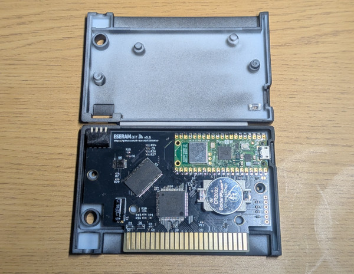
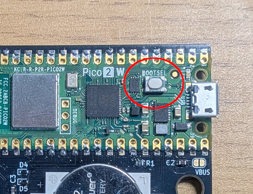
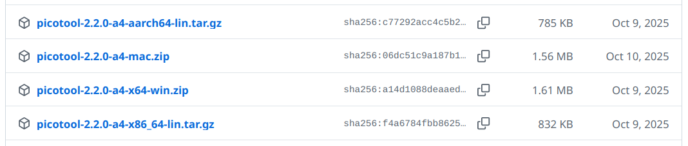

# Update Firmware

ESERAMair に搭載の Raspiberry Pi Picoのファームウェア更新手順を記載します。

以下のいずれかの方法で更新できます。

- <a href="#%E6%96%B9%E6%B3%951-bootsel%E3%83%9C%E3%82%BF%E3%83%B3%E3%82%92%E6%8A%BC%E3%81%97%E3%81%A6usb%E3%83%89%E3%83%A9%E3%82%A4%E3%83%96%E3%81%A8%E3%81%97%E3%81%A6%E8%AA%8D%E8%AD%98%E3%81%95%E3%81%9B%E3%82%8B">方法1: BOOTSELボタンを押してUSBドライブとして認識させる</a>
- <a href="#%E6%96%B9%E6%B3%952-picotool%E3%82%92%E4%BD%BF%E3%81%A3%E3%81%A6%E6%9B%B4%E6%96%B0%E3%81%99%E3%82%8B">方法2: picotoolを使って更新する</a>

方法2はカートリッジシェルを開けずに更新できますが、事前に picotool のダウンロードが必要です。

## 方法1: BOOTSELボタンを押してUSBドライブとして認識させる

### 1. Pico FW イメージをダウンロードする

<a href="../../../releases">Releases</a>から `eseramair-pico-{VER}.uf2` (以下、`eseramair-pico.uf2`)をダウンロードします。

### 2. カートリッジを開ける

裏側のネジを外し基板を取り出します。

> [!Warning]
> 前面と裏面のシェルはラベルで繋がっており分離しません。ラベルを切らないようにご注意ください。



### 3. BOOTSELボタンを押しながら micro USB でPCと接続する

Pico上にある BOOTSEL と書かれたスイッチを押しながら micro USB で PC と接続してください。



LEDは消灯したままになり、PCにUSBドライブが認識されると思います。

### 4. USBドライブに eseramair-pico.uf2 をコピーする

認識したUSBドライブを開いて、1 でダウンロードした `eseramair-pico.uf2` をコピーしてください。

コピーが完了するとともにドライブが消え、LEDが点滅し始めるはずです。

以上でファームウェアのアップデートの完了です。

## 方法2: picotoolを使って更新する

picotoolを使うと、カートリッジシェルを開けずにファームウェアを更新できます。

### 1. picotoolをダウンロードする

<a href="https://github.com/raspberrypi/pico-sdk-tools/releases">pico-sdk-tools の Releases</a>から、お使いのOSに合った picotool をダウンロードします。

version は特に指定はありません。最新バージョンで良いと思います。



ダウンロードした picotool は、コマンドラインから実行できる場所に置いてください。

### 2. Pico FW イメージをダウンロードする

<a href="../../../releases">Releases</a>から `eseramair-pico-{VER}.uf2` (以下、`eseramair-pico.uf2`)をダウンロードします。

ダウンロードしたファイルは picotool を同じディレクトリにおいてください。

### 3. カートリッジを micro USB でPCと接続する

micro USB で ESERAMair と PC を接続してください。
カートリッジシェルを開ける必要はありません。

### 4. picotool で書き込む

コマンドラインで `picotool` や `eseramair-pico.uf2` をダウンロードしたディレクトリに移動し、以下のコマンドを実行してください。

```sh
picotool load -fx eseramair-pico.uf2
```

書き込みが完了すると Pico が再起動し、LEDが点滅し始めるはずです。

以上でファームウェアのアップデートの完了です。
