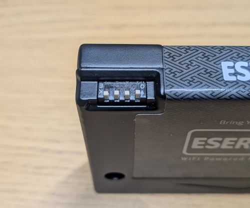
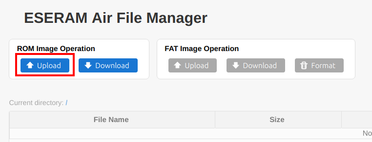
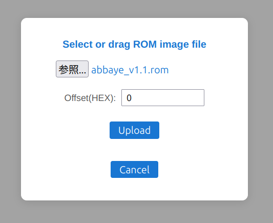
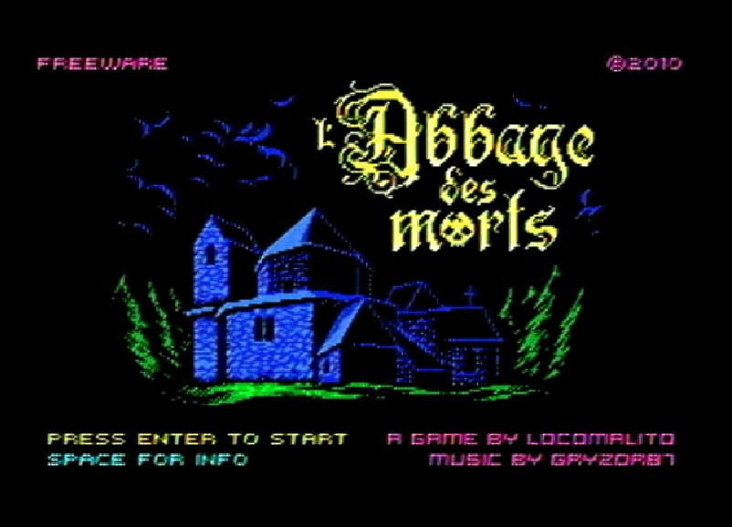
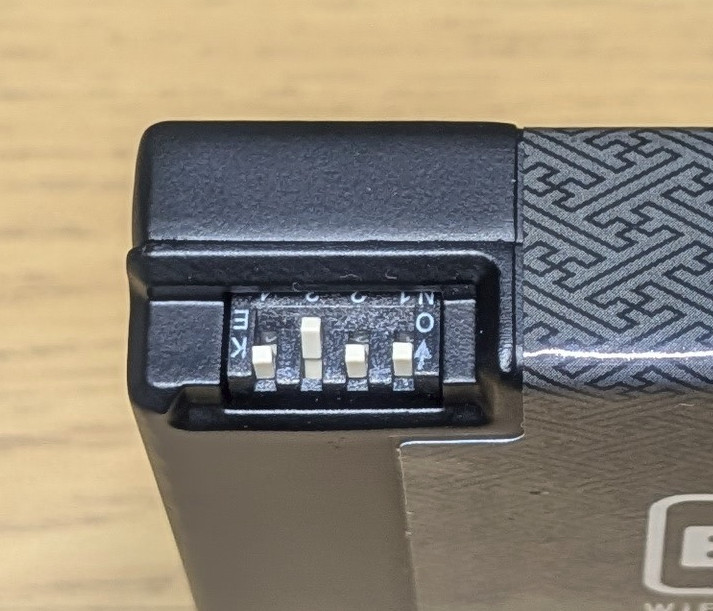
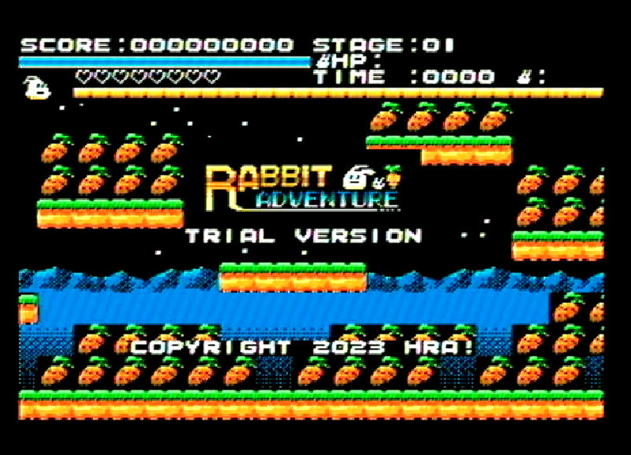

# モニターテストについて

お持ちのMSXそれぞれにて、以下の項目のテストをお願いします。

1. メガロムカートリッジとして動作するか
1. フラットなROMカートリッジとして動作するか
1. リセットでデータが壊れないか確認
1. 電源OFF/ONでデータが壊れないか確認
1. 似非RAMディスクとして使えるか (RAM64kB以上の機種のみ)

確認ができましたら、機種名と結果を discode に投稿をお願いします。
報告のフォーマットは自由ですが、参考までに雛形を書いておきます。
MSXにメモリを増設していましたら容量を記載してください。ノーマルでしたら機種名だけでOKです。

```
機種名: National CF-1200 (RAM 32KB化)
結果:
1. メガロムカートリッジとして動作するか
OK

2. フラットなROMカートリッジとして動作するか
OK

3. リセットでデータが壊れないか確認
OK

4. 電源OFF/ONでデータが壊れないか確認
NG
xxxxxxxxというメッセージが出ました

5. 似非RAMディスクとして使えるか (RAM64kB以上の機種のみ)
RAM 32kBのため skip
```

動作がおかしかったり、ご不明点があれば都度 discord にて質問をお願いします。

NG時は状況が分かるようにスクショなどを貼っていただけると、解析の助けになります。

# 確認内容

## 共通手順

[GettingStarted](../GettingStarted.md) を参照してWiFiのセットアップをして、PC からブラウザで ESERAMair の WebUI が見えることを確認してください。

## 1. メガロムカートリッジとして動作するか

※RAM16kB以上の機種でのみ確認可能

**手順 1.** ESERAMairのDIPSWを全てOFFにします。

1. OFF: ENABLE
1. OFF: 8k Bank
1. OFF: Megarom Mode
1. OFF: WriteProtect OFF



**手順 2.** https://www.msxdev.org/2020/07/27/msxdev20-15-labbaye-des-morts/ から `msxdev20_abbaye_des_morts_v1.1.zip` をダウンロードして展開します。

**手順 3.** USBケーブルでESERAMairとPCを接続します。

**手順 4.** ROM の Upload を押下し、`abbaye_v1.1.rom` を Offset: 0 で Upload します。





**手順 5.** USBケーブルを取り外し、ESERAMairをMSXに装着します

**手順 6.** MSXの電源を入れ、「l’Abbaye des Morts」のタイトル画面が表示されればOKです。



## 2. フラットなROMカートリッジとして動作するか

※RAM16kB以上の機種でのみ確認可能

**手順 1.** ESERAMairのDIPSWを以下のように設定します。

1. OFF: ENABLE
1. OFF: 8k Bank
1. **ON: Flat ROM mode**
1. OFF: WriteProtect OFF



**手順 1.** https://hra1129.github.io/original_game/rabbit_adventure.html のページ下部の「体験版 ROMイメージのダウンロード」から `rabbit_adventure_trial.rom` をダウンロードします。

**手順 2.** USBケーブルでESERAMairとPCを接続します。

**手順 3.** ROM の Upload を押下し、`rabbit_adventure_trial.rom` を Offset に 4000 を指定して Upload します。


**手順 4.** USBケーブルを取り外し、ESERAMairをMSXに装着します

**手順 5.** MSXの電源を入れ、Rabbit Adventure のタイトル画面が表示されればOKです。



## 3. リセットでデータが壊れないか確認

MainRAM容量に関係なく、全てのMSXで実行可能なテストです。

※この手順を実行するとESERAMairのSRAM内容は破壊されますのでご注意ください

**手順 1.** USBケーブルでESERAMairとPCを接続します。

**手順 2.** Teraterm で ESERAMair のコンソールを開き、以下のコマンドを実行します。

```
sram test fill
sram test check
```
OK と出るはずです。出なかったらここ以降の手順は止めてご報告をお願いします。

**手順 3.** USBケーブルを取り外します (※ポイント!!必ず外してください)

**手順 4.** ESERAMair を MSX に装着し電源を入れます

**手順 5.** MSX が起動したら、リセットスイッチでリセットします

**手順 6.** 上記 手順.5 を 5 回以上繰り返します

**手順 7.** MSX の電源を切り、ESERAMair を MSX から取り外します

**手順 8.** USBケーブルでESERAMairとPCを接続します。

**手順 9.** Teraterm で ESERAMair のコンソールを開き、以下のコマンドを実行します。

```
sram test check
```
OK と出れば成功です。

OKと出ても出なくても、結果をご報告ください。


## 4. 電源OFF/ONでデータが壊れないか確認

MainRAM容量に関係なく、全てのMSXで実行可能なテストです。

※この手順を実行するとESERAMairのSRAM内容は破壊されますのでご注意ください

**手順 1.** USBケーブルでESERAMairとPCを接続します。

**手順 2.** Teraterm で ESERAMair のコンソールを開き、以下のコマンドを実行します。

```
sram test fill
sram test check
```
OK と出るはずです。出なかったらここ以降の手順は止めてご報告をお願いします。

**手順 3.** USBケーブルを取り外します (※ポイント!!必ず外してください)

**手順 4.** ESERAMair を MSX に装着し電源を入れます

**手順 5.** MSX が起動したら、MSX の電源スイッチで電源を切ります

**手順 6.** 上記 手順.5 を 5 回以上繰り返します

**手順 7.** MSX の電源を切り、ESERAMair を MSX から取り外します

**手順 8.** USBケーブルでESERAMairとPCを接続します。

**手順 9.** Teraterm で ESERAMair のコンソールを開き、以下のコマンドを実行します。

```
sram test check
```
OK と出れば成功です。
OKと出ても出なくても、結果をご報告ください。

## 5. 似非RAMディスクとして使えるか

RAMが64kB以上搭載されているMSXで Disk BASIC もしくは、MSX-DOS(Nextor) が使えるかの確認です。
※MainRAM 64kB 以上の機体で確認してください

手順 1. [GettingStarted](../GettingStarted.md) に従って、ESERAMair に Nextor ROM を書き込んでください。

手順 2. 「Format」ボタンを押してESERAMairをフォーマットしてください。


手順 2. ESERAMair を MSX のカートリッジスロットに挿入してください。FDD搭載機の場合はFDDからフロッピーを抜いてください。

手順 3. MSXの電源を入れ、BASICが起動したら以下のような適当なプログラムを入力し、保存してください。

```
10 PRINT"HELLO ESERAM!!"
```

ESERAMairに保存します

```
SAVE"TEST.BAS"
```

手順 4. FILES で `TEST.BAS` が見えることを確認してください

```
FILES
```


# その他のフィードバック

その他気になったことや、改善点のフィードバックがあれば discord で投稿をお願いします。
特にフォーマット等はありませんので自由に書いてください。
