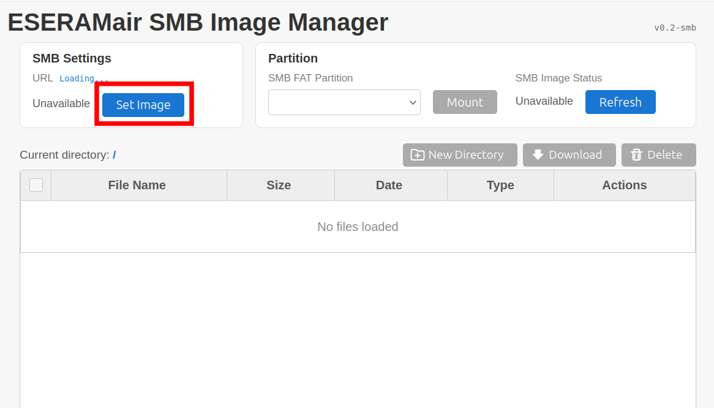
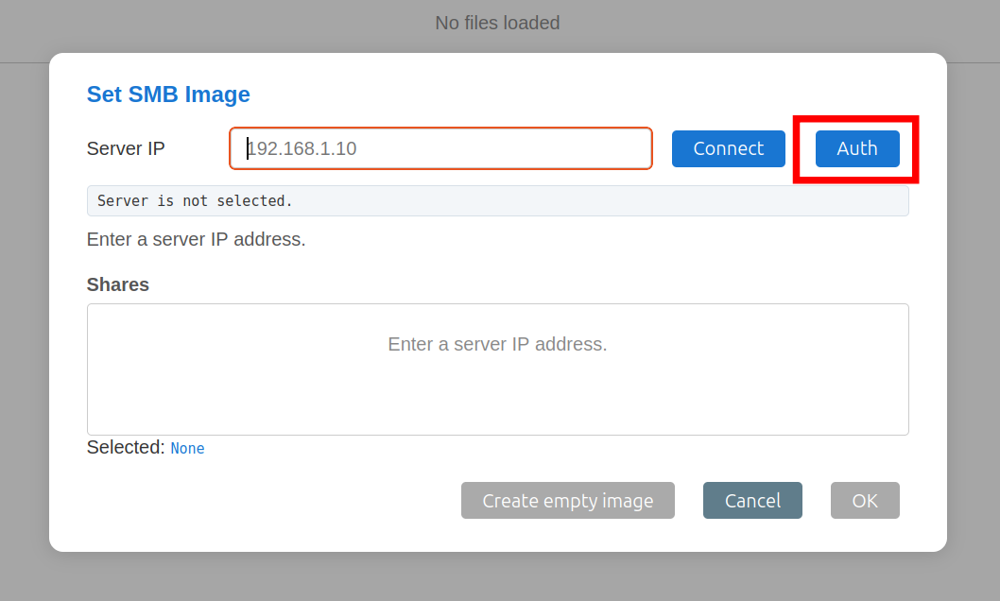
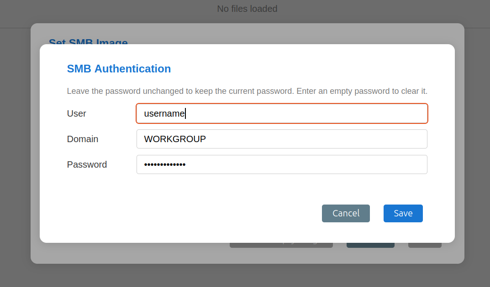
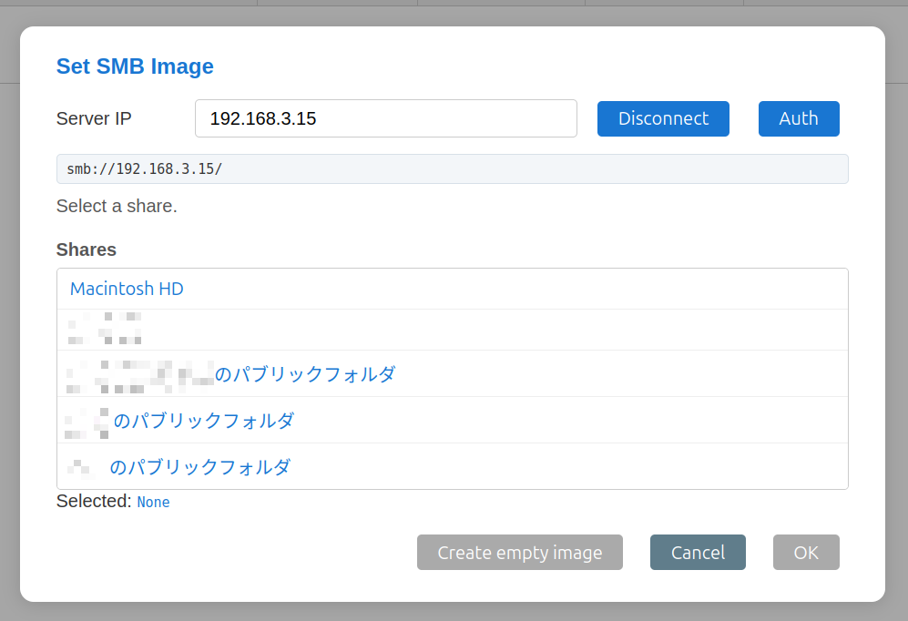
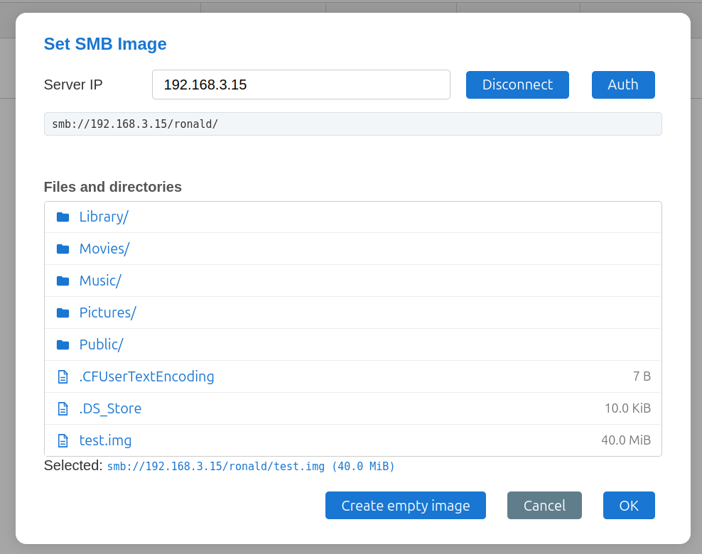
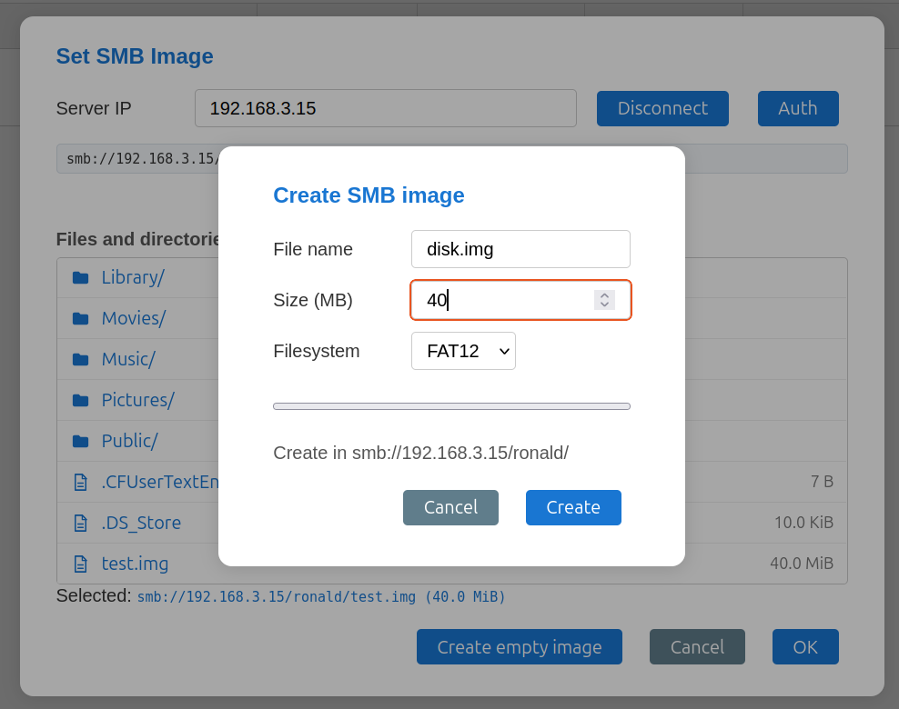
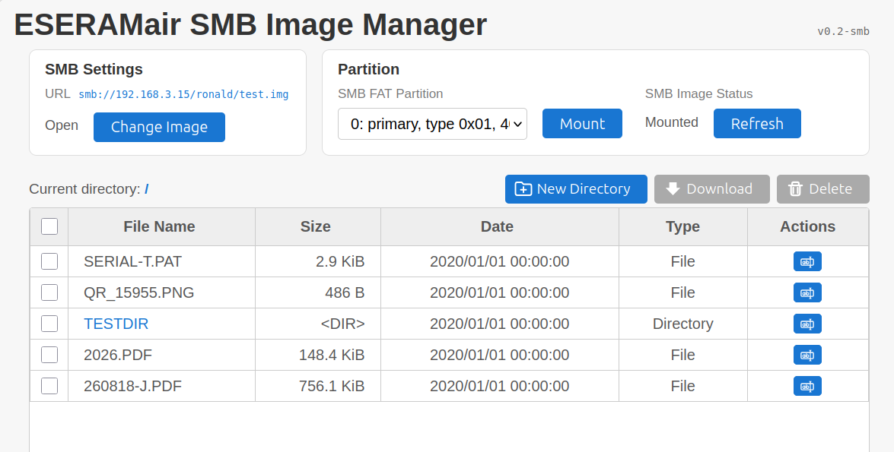
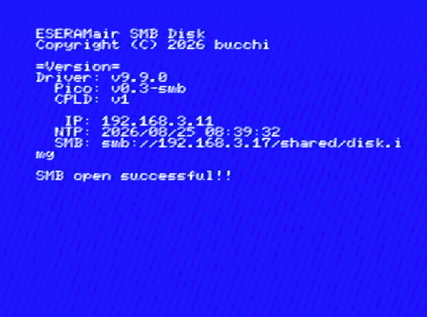
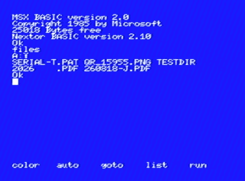

# ESERAMair-SMB

ESERAMair の SMB イメージ対応実験版ファームウェアです。  
PC や NAS の SMB 共有に置いたディスクイメージを、WiFi 経由で MSX の Nextor ドライブとして利用できます。

通常版の ESERAMair については、[ESERAMair の README](../../README.md)を参照してください。

このファームウェアは実験版です。通常版とは機能や操作方法が異なり、今後の更新で仕様が変わる可能性があります。  
開発途上なので多くの制限事項があります。PoCレベルとお考えください。

# できること

- SMB 共有上のディスクイメージを Nextor ドライブとして使用
- Web UI からの SMB サーバ、共有、ディレクトリ、イメージファイルの選択
- Web UI からの SMB 認証情報の設定
- Web UI からの ディスクイメージの作成 (FAT12 または FAT16)

Nextor ROM はファームウェアに内蔵されています。  
電源投入時に SRAM の先頭 128kB へ自動的に転送されるため、通常版のように Web UI から Nextor ROM をアップロードする必要はありません。

# 仕様

- SMB: SMB2/SMB3、NTLMSSP 認証
- ディスクイメージ: MBR 形式、512バイトセクター
- ファイルシステム: FAT12、FAT16
- イメージファイル: 4kB の倍数が必要
- Web UI から作成できるイメージサイズ: 1〜1024MB

# 使い方

## 1. ファームウェアを書き込む

[ESERAMair-SMB/rom](./rom/) から SMB イメージ対応版の UF2 ファイルをダウンロードし、通常版と同じ手順で書き込んでください。

- [ファームウェア更新手順](../../docs/UpdateFW.md)

BOOTSEL ボタンを使う方法と `picotool` を使う方法があります。書き込み後、
LED が点滅すればファームウェアの起動に成功しています。

## 2. WiFi を設定する

※通常版のFWで設定済みの場合はスキップできます

ESERAMair を MSX から取り外し、micro USB ケーブルで PC と接続します。
USB CDC のコンソールを開き、以下のコマンドを実行します。

```text
wifi ssid "SSID" "PASSWORD"
```

SSID やパスワードに空白が含まれる場合は、上の例のようにクォートで囲んでください。設定後、`status` を実行すると接続状態を確認できます。

```text
status
```

IP アドレスが取得できると、プロンプトに IP アドレスが表示されます。  
mDNS が利用できないネットワークでは、この IP アドレスを Web UI や SMB コマンドで使用してください。

WiFi 設定の詳細は [USB コンソールコマンド](../../docs/USBCLI.md)を参照してください。

この設定は通常版FWと共通設定です。

## 3. DISPWを設定する

ESERAMair の DIPSW を Nextor 用に設定します。

1. Enable/Disable: Enable
2. 8k/16k bank: 8k
3. Flat ROM: OFF
4. WriteProtect: OFF


## 4. SMB 認証情報を設定する

micro USBでPCと接続し、LEDがゆっくり点滅した状態で、ブラウザで http://eseram.local を開きます。

以下のようなページが表示されるので、SMB共有の設定をするために「Set Image」を押します。



すると「Set SMB Image」ダイアログが開きます。  
SMB共有の認証情報を設定するため、「Auth」ボタンを押します。



「SMB Authentication」ダイアログが開くので、SMBサーバの User, Domain, Passowrd を入力します。



一般的な家庭LAN環境であれば、SMBサーバが Windows でも Mac でも Domain は `WORKGROUP` で良いようです。

たぶん漢字のユーザ名でも大丈夫なはず・・・  
ダメな場合は英数字をお試しください。

設定したら「Save」を押して保存します。


## 5. SMB イメージを設定する

認証情報を保存すると、「Set SMB Image」画面に戻ります。

ここの上部にある Server IP に SMB 共有しているサーバの**IP アドレスを設定します**。

> [!IMPORTANT]
> NMBはサポートしていないので、PC名による参照ができません。IPアドレスである必要があります。
>
> また、mDNSにも対応していないため `hostname.local` のような指定も対応していません。
>
> DNSに対応していればホスト名でもOKですが、IPアドレスのほうが安全です。

IP アドレスを設定して「Connect」ボタンを押すと、以下のように共有しているフォルダの一覧が表示されます。

表示されない場合は、認証情報かIPアドレスが間違っている可能性があります。



フォルダを辿ってディスクイメージを選択して OK を押せば、ディスクイメージの選択は完了です。



ディスクイメージを持っていない場合は、新規作成することもできます。

「Create empty image」ボタンを押すと、イメージを作成するダイアログが表示されます。

この機能でディスクイメージを生成すると、ディスクの中に1つだけパーテーションが作成されたイメージが生成されます。




ディスクイメージを選択して、「OK」を押すと、以下のようにディスクイメージがマウントされ、
画面下部のファイルリストにディスクイメージ内のファイルが表示されます。

※ 空のディスクイメージを作成した場合は表示されません。



この画面からファイルのアップロード/ダウンロードをすることが可能です。


この状態まで設定できれば、セットアップ完了です。

## 5. MSX で使用する

ESERAMair を MSX に挿して電源を入れると、内蔵 Nextor ROM が SRAM に転送されます。

起動画面には Driver、Pico、CPLD のバージョン、IP アドレス、NTP時刻、SMB イメージのパスが表示されます。



WiFi 接続や SMB イメージの open が完了していない場合は、画面に現在の状態が
表示されます。

- `WiFi connection wait`: WiFi 接続待ち
- `IP address wait`: IP アドレス取得待ち
- `SMB open wait`: SMB イメージ open 待ち

`ESC` キーを押すと待ちをスキップできます。ただし、SMB イメージが open されていない状態では Nextor ドライブを利用できません。

**SMB open successful!!** を表示されていたら接続OKです。起動するとディスクが使用可能なはずです。



ESERAMair は 1MB のSRAMですが、このファームを使うことで広大なディスクが使用できるようになります。

# 制限事項

まだ開発途中のPoCレベルなので制限事項があります。

- 不安定です。「やっと動くようになった」くらいとお考えください。
- 途中でハングしたりするかもしれません。ファイルが失われる可能性もありますのでご注意ください。
- 電源を入れてから、WiFi接続、IPアドレス取得、NTPで時刻取得、SMB共有からディスクイメージを開く、といった一連の操作があるので、起動まで時間がかかるかもしれません。  
再起動する際は、リセットがある機種ではリセットすると接続が維持された状態で再起動するため、スムーズに起動できます。
- 特にWebUIは正常系以外の操作はボロボロです。やさしく扱ってください。
- Webからのファイル変更と、MSXからのファイル変更は同期していません。  
MSXから変更した場合はWeb側でリロードしてください。  
Webから変更したらMSXをリセットしてください。
